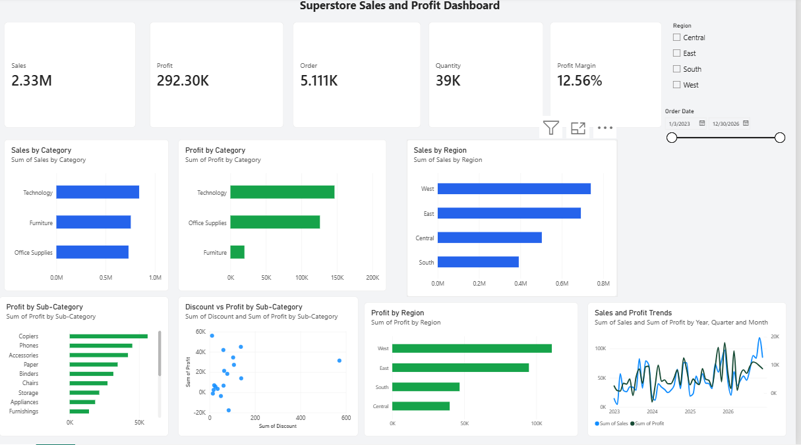

# Superstore Sales & Profitability Analysis

## Project Overview

This project analyzes the Superstore sales dataset to identify key patterns in sales performance, profitability, and discounting.

The analysis focuses on understanding overall business performance, comparing product categories and sub-categories, identifying loss-making products, and examining whether discounting is associated with weaker profitability.

## Business Questions

The project addresses the following questions:

- How is the business performing overall in terms of sales and profit?
- Which product categories generate the strongest and weakest profitability?
- Which sub-categories are responsible for significant losses?
- How are discounts associated with profitability?
- Which individual products contribute most heavily to losses?
- What actions could management consider to improve profitability?

## Tools Used

- **Python**
- **Pandas** — data cleaning, transformation, and analysis
- **Matplotlib** — data visualization
- **Jupyter Notebook** — exploratory data analysis and documentation
- **SQL** — additional data analysis
- **Power BI** — dashboard development and business reporting

## Key Findings

- Total sales were approximately **$2.33 million**.
- Total profit was approximately **$292,297**.
- Overall profit margin was approximately **12.56%**.
- **Technology** had the highest category profit margin at approximately **17.45%**.
- **Office Supplies** had a profit margin of approximately **17.22%**.
- **Furniture** generated approximately **$754,748 in sales** but achieved a profit margin of only **2.61%**.
- Within Furniture, **Tables** generated a loss of approximately **$17,753**, while **Bookcases** generated a loss of approximately **$3,632**.
- Tables and Bookcases also showed relatively high average discount levels.
- Product-level analysis showed that Furniture losses were concentrated among a relatively small group of products.

## Business Recommendations

1. Review discounting strategies for Tables and Bookcases.
2. Investigate the highest loss-making Furniture products individually.
3. Monitor profit margin alongside sales rather than evaluating performance based on sales alone.
4. Prioritize targeted changes to underperforming products and sub-categories before making category-wide changes.
5. Continue monitoring the relationship between discounts and profitability while also considering pricing and product costs.

## Project Structure

    Project_01/
    ├── data/
    ├── images/
    ├── notebooks/
    ├── power bi/
    ├── sql/
    └── README.md

## Analysis Notebook

The primary Python analysis is contained in:

`notebooks/01_sales_data_exploration.ipynb`

The notebook includes data quality checks, exploratory analysis, category and sub-category performance analysis, discount analysis, Furniture profitability analysis, product-level investigation, visualizations, and final business recommendations.

## Conclusion

The Superstore is profitable overall, but profitability differs substantially across product categories. Furniture represents the clearest opportunity for improvement, particularly within Tables and Bookcases.

The findings suggest that targeted reviews of discounting, pricing, product costs, and individual loss-making products could help improve profitability while protecting overall sales performance.

## Power BI Dashboard

An interactive Power BI dashboard was developed to summarize sales and profitability performance across categories, sub-categories, regions, and time.

[Download the Power BI Dashboard (.pbix)](powerbi/Superstore%20Sales%20Profit%20Dashboard.pbix)